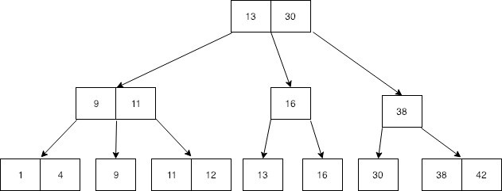
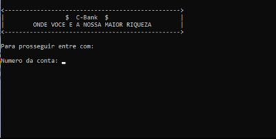

<h1 align="center">
    
</h1>

  <a href="#-projeto">Projeto</a>
  &nbsp;&nbsp;&nbsp;|&nbsp;&nbsp;&nbsp;
  <a href="#-motivação">Motivação</a>
  &nbsp;&nbsp;&nbsp;|&nbsp;&nbsp;&nbsp;
  <a href="#-operações-implementadas">Operações implementadas</a>

## ✦ Projeto

O projeto consistiu de um trabalho prático e teve como base o desenvolvimento de um sistema que utilizou uma árvore B como estrutura para armazenamento de dados.

O C-Bank é um sistema bancário básico, onde é possível a realização das operações padrões de um caixa eletrônico convencional, operações essas que foram todas desenvolvidas tendo como base a estrutura e os códigos disponíveis na bibliografia da disciplina referentes a <a href="http://www2.dcc.ufmg.br/livros/algoritmos/index.php">árvore B</a>.

    

## ✦ Motivação

A escolha da estrutura arvore B não foi aleatória, essa foi feita levando-se em conta as suas propriedades. É uma estrutura balanceada que foi projetada para trabalhar com pesquisa em memória externa, essa que é utilizada em praticamente todo sistema convencional uma vez que a memória primaria não é capaz de armazenar uma dada quantidade de registros.

O algoritmo é simples, de fácil manutenção, eficiente e bastante versátil. O mesmo permite acesso sequencial eficiente e possui um custo logarítmico para recuperar, inserir e retirar registros do arquivo. O que para grandes volumes de dados é fantástico.

## ✦ Operações implementadas

As operações criadas foram cinco, sendo elas:

1. Visualização dos dados da conta;
2. Saque;
3. Depósito;
4. Transferência financeira;
5. Exclusão da conta.

 

    

---

O projeto foi desenvolvido, para fins didáticos, durante a disciplina de Algoritmos e Estrutura de Dados II do curso de Bacharelado em Ciência da Computação da UFV – Campus Florestal

